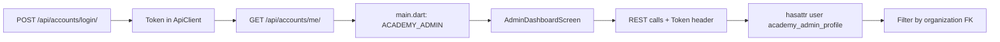
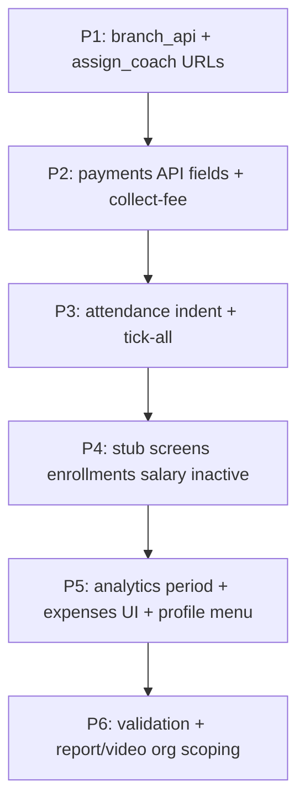

# Academy Admin Panel — Analysis and Fix Plan

## How Academy Admin Access Works

| Layer | Location | Behavior |
|-------|----------|----------|
| Role | [`backend/accounts/models.py`](backend/accounts/models.py) | `CustomUser.user_type = 'ACADEMY_ADMIN'` + `AcademyAdminProfile` → `Organization` |
| Auth | [`backend/sportsverse_project/settings.py`](backend/sportsverse_project/settings.py) | DRF `TokenAuthentication`, default `IsAuthenticated` |
| Authorization | Scattered in views (e.g. [`admin_views.py`](backend/accounts/views/admin_views.py), [`organizations/views.py`](backend/organizations/views.py)) | No shared `BasePermission`; each view checks `academy_admin_profile` |
| Frontend entry | [`frontend/lib/main.dart`](frontend/lib/main.dart) | Routes `ACADEMY_ADMIN` → [`admin_dashboard_screen.dart`](frontend/lib/screens/academy_admin/admin_dashboard_screen.dart) |

**Implication:** Most bugs are **integration mismatches** (wrong URL prefixes, missing response fields, stub screens) plus **one critical backend indentation bug** in attendance.

---

## Bug Root Causes (by feature)

### 1. Analytics dashboard — date range + extra analytics

**Current:** [`admin_dashboard_screen.dart`](frontend/lib/screens/academy_admin/admin_dashboard_screen.dart) dropdown has only `"This Year"` and `onChanged: (_) {}` (no-op). [`_loadAnalytics()`](frontend/lib/screens/academy_admin/admin_dashboard_screen.dart) calls `GET /api/payments/dashboard/analytics/` with **no query params**.

**Backend:** [`get_dashboard_analytics`](backend/payments/views.py) hardcodes `current_year` only—ignores period.

**Fix:**
- Add `?period=month|quarter|year` to `get_dashboard_analytics` and filter `income_qs` / expense querysets by date range.
- Wire dropdown to state (`_selectedPeriod`), refetch on change.
- **Extra analytics (UI):** Add KPI row above chart using existing response: `summary.total_income`, `total_expense`, `total_profit`, plus `GET /api/accounts/dashboard-stats/` for student/coach/branch/batch counts. Optionally show `monthly` sparkline or quarterly bars from response keys already returned but unused in [`financial_chart.dart`](frontend/lib/widgets/financial_chart.dart).

---

### 2. Expenses collapsible

**Current:** Expenses block is a static [`EliteCard`](frontend/lib/screens/academy_admin/admin_dashboard_screen.dart) on the home dashboard (always expanded).

**Fix:** Wrap expenses section in `ExpansionTile` / `AnimatedCrossFade` (collapsed by default), keep existing `fetchExpenses` + add-expense dialog.

---

### 3. Name, email, phone, password strength

**Primary screen:** [`add_student_enrollment_screen.dart`](frontend/lib/screens/academy_admin/add_student_enrollment_screen.dart) — has basic validators (email regex, phone min 10, password min **6**); confirm password does **not** compare in `validator`.

**Also improve:** [`coach_enroll_screen.dart`](frontend/lib/screens/coaches/coach_enroll_screen.dart) — only `"Required field"`.

**Fix:**
- Add shared validator helper (e.g. `frontend/lib/utils/form_validators.dart`): name (letters/spaces, min 2), email, phone (10–15 digits), password strength (min 8, upper + lower + digit—match [`change_password_screen.dart`](frontend/lib/screens/auth/change_password_screen.dart)).
- Student: strengthen password validator; confirm must match `_passwordController.text`.
- Coach enroll: apply same rules before `POST /api/coaches/enroll/`.

---

### 4. Edit branch

**Root cause:** [`branch_api.dart`](frontend/lib/api/branch_api.dart) — `getBranches()` uses `/api/organizations/branches/` but **create/update/delete/get** use `/api/accounts/branches/` which **does not exist** in [`accounts/urls.py`](backend/accounts/urls.py).

**Fix:** Point all CRUD to `/api/organizations/branches/` and `/api/organizations/branches/<id>/` (matches [`BranchListCreateView`](backend/organizations/views.py)).

---

### 5. View enrollments (batch management)

**Current:** [`batch_management_screen.dart`](frontend/lib/screens/academy_admin/batch_management_screen.dart) `_navigateToEnrollments` shows snackbar `"Coming Soon!"`.

**Fix:** New screen `batch_enrollments_screen.dart`:
- `GET /api/organizations/enrollments/?batch=<id>` (already supported in [`EnrollmentListCreateView`](backend/organizations/views.py))
- List student name, enrollment type, sessions, `is_active`, enrolled date
- Navigate from batch popup menu

---

### 6. Enrolled coaches + assign coach

| Issue | Cause | Fix |
|-------|-------|-----|
| Enrolled coaches blank/error | [`coach_list_screen.dart`](frontend/lib/screens/coaches/coach_list_screen.dart) no error handling if non-200; stays loading | Handle errors; show empty state; verify `GET /api/coaches/list/` |
| Assign coach fails off-device | [`assign_coach.dart`](frontend/lib/screens/coaches/assign_coach.dart) hardcodes `http://127.0.0.1:8000` | Replace with `ApiClient.baseUrl` + token from `ApiClient` |
| Unused broken screen | `coach_assignment_screen.dart` uses wrong `/api/accounts/coaches/` | Either delete from nav or fix to use `/api/coaches/assign/` POST payload (`coach_id`, `branch_id`, `sport_id`, `batch_id`) |

---

### 7. Assign inactive students to a batch

**Current:** No UI. Backend sets `enrollment.is_active = False` when session limit reached ([`organizations/views.py`](backend/organizations/views.py) ~L436).

**Fix:**
- New screen `assign_inactive_students_screen.dart` under Students sidebar
- `GET /api/organizations/enrollments/?batch=` optional; list enrollments with `is_active=false` for org (add `?is_active=false` filter on backend list view if missing)
- Admin selects target batch → `POST /api/organizations/enrollments/` with existing `student`, new `batch`, `enrollment_type`, sessions (reuse [`EnrollmentSerializer`](backend/organizations/serializers.py) validation—blocks duplicate active enrollment in same batch)

---

### 8. Mark attendance — tick all

**Current:** Sidebar uses [`mark_attendence.dart`](frontend/lib/screens/academy_admin/mark_attendence.dart) (bulk API, **no** select-all). [`take_attendance_screen.dart`](frontend/lib/screens/academy_admin/take_attendance_screen.dart) has tick-all but is not in sidebar.

**Fix (preferred):** Add to `MarkAttendanceScreen`:
- `_selectAll` toggle + “Mark all present” button
- Set all eligible `attendanceMap` entries (skip `already_marked` / session completed)
- Keep `POST /api/organizations/attendance/mark-bulk/`

**Backend (critical):** Fix indentation in [`organizations/views.py`](backend/organizations/views.py)—`perform_create` at L367 and `BatchStudentsForAttendanceView.get` at L446 are **outside their classes**. Move `perform_create` inside `AttendanceListView`; fix or remove orphaned `BatchStudentsForAttendanceView.get` (bulk path already works via `BulkAttendanceMarkView`).

---

### 9. Student payment status — overflow + not reflected

**Overflow:** [`student_payment_screen.dart`](frontend/lib/screens/academy_admin/student_payment_screen.dart) L310–316 — `Row` with long name + `Chip` without `Expanded`/`Flexible`.

**Payment not reflected — two bugs:**

1. **Missing API fields:** UI reads `is_defaulter`, `display_status`, `total_fees_paid` but [`BatchFinancialsSummaryView`](backend/accounts/views/admin_views.py) never returns them (grep confirms zero backend matches).

2. **Wrong collect-fee logic:** Screen posts to `/api/payments/collect-fee/` ([`payments/views.py`](backend/payments/views.py) L143–146) uses `.last()` on **all** transactions—not `is_paid=False`—can mark wrong row. [`admin_views.py`](backend/accounts/views/admin_views.py) version is correct; frontend should use one canonical endpoint.

**Fix:**
- Extend `BatchFinancialsSummaryView` (single implementation—prefer `admin_views.py`, remove duplicate in `payments/views.py` or delegate):
  - `total_fees_paid` = sum of paid `FeeTransaction.amount`
  - `is_defaulter` = unpaid count > 0 OR session policy rules
  - `display_status` = human-readable string
- Fix `CollectStudentFeeView` in payments to filter `is_paid=False` first (match accounts version); add admin org check.
- Frontend: layout fix (`Expanded` on name, `FittedBox` on status); refactor payment dialog to `StatefulBuilder` so payment method updates; parse `amount` as number; after success, refresh and update `_selectedStudentData` from new list.

---

### 10. Pay salary + salary history

**Current:** [`pay_salary_screen.dart`](frontend/lib/screens/academy_admin/pay_salary_screen.dart) — empty dropdown, `_handlePayment()` stub. [`salary_details_screen.dart`](frontend/lib/screens/academy_admin/salary_details_screen.dart) — mock table.

**Backend exists:** `POST /api/payments/add-salary/` (`coach_id`, `amount`, `payment_period`) in [`payments/views.py`](backend/payments/views.py).

**Fix:**
- Load coaches from `GET /api/coaches/list/`
- Submit salary via `PaymentApi` or direct POST
- Salary history: `GET /api/payments/expenses/` already returns salary rows—or add filtered endpoint; bind `SalaryDetailsScreen` to real data

---

### 11. Send video

**Bug:** [`send_video_screen.dart`](frontend/lib/screens/academy_admin/send_video_screen.dart) L132 hardcodes `"organization": 1`.

**Fix:** Read `organization_id` from `AuthProvider` profile (`/api/accounts/me/` → `profile_details.organization_id`). Verify multipart field names match [`VideoUploadViewSet`](backend/academy_contents/views.py).

---

### 12. Upload student report

**Bug:** [`player_report_screen.dart`](frontend/lib/screens/academy_admin/player_report_screen.dart) fetches students via `GET /api/organizations/students/?batch=` but [`StudentListCreateView`](backend/organizations/views.py) **does not filter by batch**.

**Fix:** Use `GET /api/accounts/students/?batch=` (supported in [`admin_views.py`](backend/accounts/views/admin_views.py)) or `GET /api/organizations/enrollments/?batch=`.
- Add `permission_classes` + org scoping on [`ReportUploadView`](backend/academy_reports/views.py) (currently open).
- Harden `student_ids` parsing (handle list vs comma string).

---

### 13. Logout → profile icon on admin dashboard

**Current:**
- Desktop header: avatar with **no** menu ([`_buildTopHeader`](frontend/lib/screens/academy_admin/admin_dashboard_screen.dart))
- Mobile app bar + sidebar: red **logout** button

**Fix:**
- Replace standalone logout in sidebar/mobile with **profile `PopupMenuButton`** on avatar (show name, email from `AuthProvider`, “Logout” action calling existing `_adminLogout`)
- Remove duplicate logout icon from mobile `GlassHeader` actions
- Optional: simple read-only admin profile bottom sheet (no new backend required)

---

## Implementation Order (recommended)

1. **Quick wins (API path fixes):** `branch_api.dart`, `assign_coach.dart`, `player_report` student fetch, `send_video` org id  
2. **Payments (highest user-visible):** backend financial fields + collect-fee + frontend overflow/dialog refresh  
3. **Attendance:** backend class indentation + mark attendance select-all  
4. **New/completed screens:** batch enrollments, pay salary, salary history, assign inactive students  
5. **Dashboard polish:** analytics period, KPI cards, collapsible expenses, profile menu  
6. **Validation:** shared validators on student/coach enroll  

---

## Files to Change (primary)

| Area | Backend | Frontend |
|------|---------|----------|
| Branches | — | [`branch_api.dart`](frontend/lib/api/branch_api.dart) |
| Analytics | [`payments/views.py`](backend/payments/views.py) | [`admin_dashboard_screen.dart`](frontend/lib/screens/academy_admin/admin_dashboard_screen.dart), [`financial_chart.dart`](frontend/lib/widgets/financial_chart.dart) |
| Payments | [`admin_views.py`](backend/accounts/views/admin_views.py), [`payments/views.py`](backend/payments/views.py) | [`student_payment_screen.dart`](frontend/lib/screens/academy_admin/student_payment_screen.dart) |
| Attendance | [`organizations/views.py`](backend/organizations/views.py) | [`mark_attendence.dart`](frontend/lib/screens/academy_admin/mark_attendence.dart) |
| Enrollments | optional `?is_active` filter | `batch_enrollments_screen.dart`, [`batch_management_screen.dart`](frontend/lib/screens/academy_admin/batch_management_screen.dart) |
| Salary | — | [`pay_salary_screen.dart`](frontend/lib/screens/academy_admin/pay_salary_screen.dart), [`salary_details_screen.dart`](frontend/lib/screens/academy_admin/salary_details_screen.dart) |
| Coaches | — | [`assign_coach.dart`](frontend/lib/screens/coaches/assign_coach.dart), [`coach_list_screen.dart`](frontend/lib/screens/coaches/coach_list_screen.dart) |
| Reports/Video | [`academy_reports/views.py`](backend/academy_reports/views.py) | [`player_report_screen.dart`](frontend/lib/screens/academy_admin/player_report_screen.dart), [`send_video_screen.dart`](frontend/lib/screens/academy_admin/send_video_screen.dart) |
| Validation | — | new `form_validators.dart`, enrollment + coach screens |
| Profile UI | — | [`admin_dashboard_screen.dart`](frontend/lib/screens/academy_admin/admin_dashboard_screen.dart) |

---

## Testing Checklist (manual)

- Login as academy admin; confirm dashboard loads analytics for Month / Quarter / Year  
- Create, edit, delete branch; verify list refreshes  
- Open batch → View Enrollments shows students  
- Mark attendance: select all → bulk save → view attendance reflects  
- Record student payment → status card updates without overflow  
- Pay coach salary → appears in expenses / salary history  
- Send video + upload report with correct org and batch students  
- Enroll coach / student with validation errors on weak password  
- Reassign inactive student to new batch  
- Profile menu logout works on desktop and mobile  
